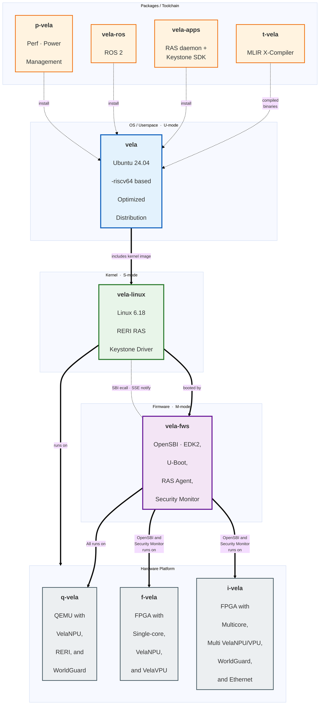

## 1. Relationships among repositories

Solid line = build/runtime dependency; dashed line = loose reference

## 2. Version pinning

This repository pins each component to a specific commit using Git submodules.

| Repo | 2026-08 | 2026-11 |
|---|---|---|
| [`vela-apps`](https://github.com/riscv-vela/vela-apps) | `v26.08` | `v26.11` |
| [`vela-ros`](https://github.com/riscv-vela/vela-ros) | `v26.08` | `v26.11` |
| [`vela`](https://github.com/riscv-vela/vela) | `v26.08` | `v26.11` |
| [`p-vela`](https://github.com/riscv-vela/p-vela) | — | `v26.11` |
| [`t-vela`](https://github.com/riscv-vela/t-vela) | — | `v26.11` |
| [`vela-fws`](https://github.com/riscv-vela/vela-fws) |`v26.08` | `v26.11` |
| [`q-vela`](https://github.com/riscv-vela/q-vela) | `v26.08` | `v26.11` |
| [`f-vela`](https://github.com/riscv-vela/f-vela) | — | `v26.11` |
| [`i-vela`](https://github.com/riscv-vela/f-vela) | — | `v26.11` |

