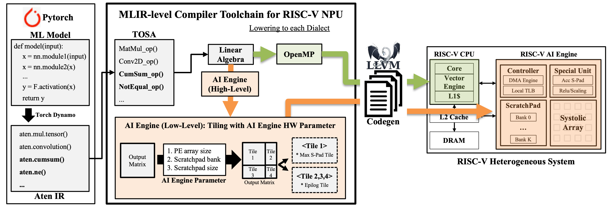

> [!NOTE]
> **Coming soon.** T-Vela is currently under internal development and will be
> released publicly as part of the [Vela](https://github.com/riscv-vela/vela)
> project. Stay tuned for the initial public release.
>
> ## What is T-Vela

The T-Vela Project aims to develop a compiler toolchain and optimization techniques for efficiently running PyTorch models on RISC-V based systems.
Through MLIR-based IR transformation and optimization, models are converted into target hardware-friendly forms, and optimized binaries are generated by reflecting the specifications of the target AI engine.

